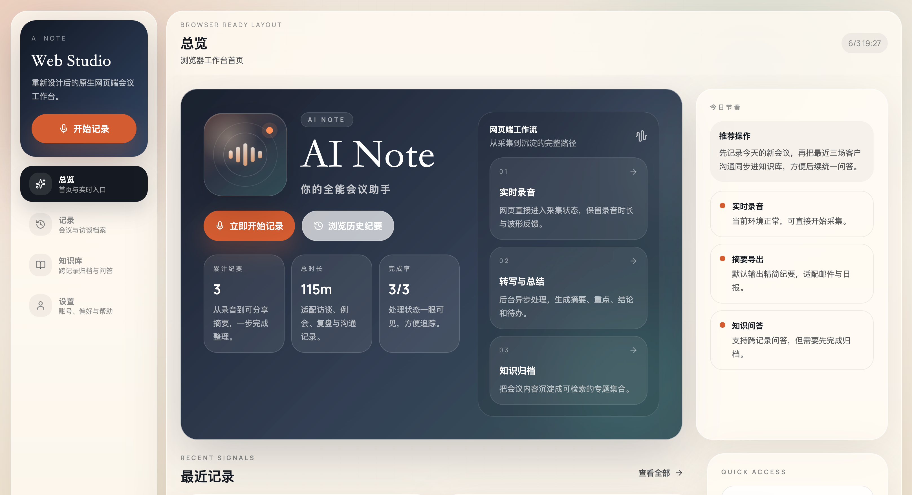

  

<h1 align="center">AI Note</h1>

  <strong>RECORD · TRANSCRIBE · SUMMARIZE</strong> 
  网页端全能会议助手 · 录音 / 转写 / 总结一站完成

  
  &nbsp;
  

  
  
  
  

 

---

## ✨ 产品简介

**AI Note — 你的全能会议助手**

AI Note Web Studio 是一款专为职场人士打造的**原生网页端**会议记录与知识管理工具。无需安装任何客户端，打开浏览器即可进入实时录音状态，全程保留录音时长与波形反馈，让采集过程直观可感。

录音结束后，系统将在后台异步完成转写与 AI 总结，自动生成**摘要、重点论述、会议结论及待办事项**，彻底告别手动整理的繁琐。每条会议记录均清晰标注时长、重点数量与完成状态，一眼即可掌握处理进度。

产品还内置**知识库功能**，可将销售沟通、产品评审、项目例会等不同类型的记录按专题归档，并支持**跨记录的自然语言问答**——直接提问"过去三次客户沟通里最常被提到的问题是什么"，即可从多条记录中提炼答案，让会议内容真正沉淀为可检索、可复用的团队知识资产。

界面设计克制优雅，深色工作台搭配清晰的信息层级，适合桌面端长时间沉浸式使用，是提升会议效率、打通信息孤岛的理想选择。

 

## 🎬 产品截图

  
   
  <b>网页端全能会议助手 · 录音 / 转写 / 总结一站完成</b>

 

## 🪐 立即体验

**🌐 官网体验：[hyz.ryanssuit.com](https://hyz.ryanssuit.com/)**

无需安装 · 网页直达

 

## 🛸 关于 Innate Labs

> **Building AI-native products & agents for the next generation of founders.**

[Innate Labs](https://github.com/Innate-Labs) 致力于打造下一代 AI 原生产品与智能体（Agents）。
**AI Note** 是我们 **04 期** 学员作品中 **AI 助手类** 方向的优秀代表。

- 🌐 GitHub：<https://github.com/Innate-Labs>
- 🪐 产品官网：<https://hyz.ryanssuit.com/>

 

---

  
    © 2026 <a href="https://github.com/Innate-Labs"><b>Innate Labs</b></a> &nbsp;·&nbsp;
    Crafted with 🌊 and ✨ AI &nbsp;·&nbsp;
    <a href="https://hyz.ryanssuit.com/">hyz.ryanssuit.com</a>
  

